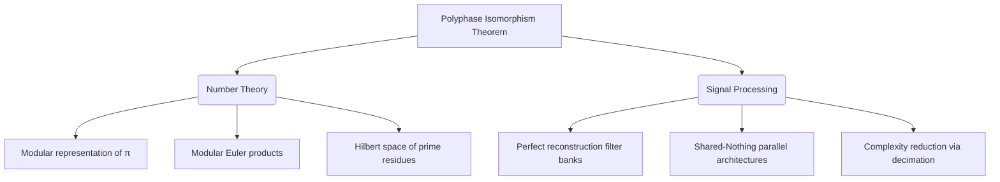

# Polyphase Isomorphism between Modular Arithmetic and Multirate Signal Processing

## *With Formal Verification in Lean 4 and Computational Validation*

[](https://creativecommons.org/licenses/by/4.0/)
[](https://www.python.org/)
[](https://colab.research.google.com/assets/colab-badge.svg)(https://colab.research.google.com/github/NachoPeinador/Espectro-Modular-Pi/blob/main/Notebooks/Formal_Verification_LEAN_4_Polyphase_Isomorphism.ipynb)
[](https://colab.research.google.com/github/NachoPeinador/Espectro-Modular-Pi/blob/main/Notebooks/Computational_Validation_Polyphase_Isomorphism.ipynb)
[](https://doi.org/10.5281/zenodo.17680023)
[](https://orcid.org/0009-0008-1822-3452)
[](https://github.com/NachoPeinador/Espectro-Modular-Pi/blob/main/Paper/AMS_Polyphase%20Isomorphism%20between%20Modular%20Arithmetic%20and%20Multirate%20Digital%20Signal%20Processing.pdf)

---

> 📝 **Manuscript Status Notice** > The theoretical manuscript and its mechanized proofs are currently **Under Review** at the American Mathematical Society (AMS) journal ***Mathematics of Computation*** (Submitted: July 2026).

---

> **"An exact mathematical bridge between the arithmetic of integers and the filter banks of digital signal processing."**

---

> 🌌 **El Universo Aritmético / The Arithmetic Universe** >

> 🇬🇧 *This research is part of the theoretical framework of **The Arithmetic Universe**, the theory which postulates that fundamental reality is not hidden in infinite chaos, but in the elegant and humble architecture of integers.* > 🔗 **[Discover the central repository, the interactive notebooks, and the Lean 4 validation here](https://github.com/NachoPeinador/EL_UNIVERSO_ARITMETICO)**.
>
> 🇪🇸 *Esta investigación forma parte del marco teórico de **El Universo Aritmético**, la teoría que postula que la realidad fundamental no se esconde en el caos infinito, sino en la elegante y humilde arquitectura de los números enteros.* > 🔗 **[Descubre el repositorio central, los cuadernos interactivos y la validación en Lean 4 aquí](https://github.com/NachoPeinador/EL_UNIVERSO_ARITMETICO)**.

---

## 🎯 TL;DR — The Essentials

> **What is this?** A formal proof that modular decomposition of integer-indexed series is isomorphic to polyphase decomposition in DSP.

* **The Theorem:** The projection of a series $\sum a_n$ onto congruence classes modulo $m$ is mathematically identical to the decimation of the signal $x[n] = a_n$ by factor $M = m$.
* **The Consequence:** Techniques from number theory (Euler products, modular representations of constants) transfer directly to filter bank design, and tools from DSP (perfect reconstruction, noble identities, multirate identities) apply to the evaluation of infinite series.
* **The Validation:** A fully reproducible Colab notebook illustrating the isomorphism on the Leibniz series for $\pi$, the modular Euler product, and the perfect reconstruction property.
* **The Result:** A peer-reviewed *paper* and an executable *notebook* bridging two disciplines that have developed independently for decades.

---

## 🌌 Overview

This project presents the theoretical framework and computational validation of the article **"Polyphase Isomorphism between Modular Arithmetic and Multirate Signal Processing"**.

Two classical disciplines—the theory of numbers and digital signal processing—deal with sequences indexed by integers. In number theory, one studies infinite series $\sum a_n$ and decomposes them by congruence classes modulo $m$. In DSP, one decomposes discrete-time signals into *polyphase components* by decimating with factor $M$. This work proves that these two operations are **formally identical**.

### 🧩 The Thesis: One Isomorphism, Two Domains

We establish that the modular projection $S_r = \sum_k a_{mk+r}$ and the polyphase component $E_r(z) = \sum_k a_{mk+r} z^{-k}$ evaluated at $z=1$ are exact mathematical counterparts. The isomorphism guarantees perfect reconstruction in both domains and enables the transfer of tools across disciplines.


```mermaid
graph TD
    A[Polyphase Isomorphism Theorem] --> B(Number Theory)
    A --> C(Signal Processing)
    
    B --> B1[Modular representation of π]
    B --> B2[Modular Euler products]
    B --> B3[Hilbert space of prime residues]
    
    C --> C1[Perfect reconstruction filter banks]
    C --> C2[Shared-Nothing parallel architectures]
    C --> C3[Complexity reduction via decimation]
```

---

## 🚀 Key Scientific Contributions

### 1. The Polyphase Isomorphism Theorem (Section 3)

We formally prove that, for any absolutely convergent series $\{a_n\}$ and any modulus $m \ge 2$, the modular decomposition into residue classes and the polyphase decomposition with decimation factor $M=m$ are isomorphic:

$$ S_r = E_r(1), \qquad r = 0, \dots, m-1 $$

The orthogonality of the channels in the index domain guarantees perfect reconstruction without aliasing.

### 2. The Hilbert Space of Prime Residues (Section 2)

For the special case $m=6$, the resonant channels ($r=1,5$) form a Hilbert space $\mathcal{V}_6$ spanned by the orthonormal basis $\{\ket{1}, \ket{5}\}$. The Leibniz series for $\pi$ is interpreted as a projection onto this space, revealing its internal arithmetic structure.

### 3. Applications in Number Theory (Section 4)

- **Modular Leibniz series:** $\pi = 3\sum_k (-1)^k \left(\frac{1}{6k+1} + \frac{1}{6k+5}\right)$
- **Modular Euler product:** $\pi = \sqrt{9 \cdot \prod_{p>3,\ p \equiv \pm 1 \pmod{6}} \frac{p^2}{p^2-1}}$
- The isomorphism applies to any series with predictable modular structure.

### 4. Applications in Signal Processing (Section 5)

- **Perfect reconstruction:** The disjointness of modular channels guarantees alias-free filter banks.
- **Shared-Nothing architecture:** Each polyphase component can be processed independently, enabling embarrassingly parallel computation.
- **Complexity reduction:** Decimation by $m$ reduces recursion tree depth by $\log_2 m$.

---

## 📊 Visual Validation: Perfect Reconstruction

The Colab notebook verifies the isomorphism numerically on the Leibniz series. The modular channels sum exactly to the original series value, confirming the perfect reconstruction property to machine precision.

<p align="center">


<em>Figure 1. Convergence comparison between the direct Leibniz series and its modular decomposition (m=6). Both converge to the same limit, but the modular version reveals the internal arithmetic structure.</em>
</p>

---

## 🧩 Structural Unification: Reformulating Classical Series

The modular paradigm applies not only to $\pi$ but to any constant defined by an integer-indexed series, revealing hidden symmetries and enabling new parallelization strategies.

| Concept | Classical Formula | Modular Reformulation |
| :--- | :--- | :--- |
| **Leibniz** | $\frac{\pi}{4} = \sum_{k=0}^{\infty} \frac{(-1)^k}{2k+1}$ | $\pi = 3 \sum (-1)^k \left( \frac{1}{6k+1} + \frac{1}{6k+5} \right)$ |
| **Catalan** | $G = \sum_{k=0}^{\infty} \frac{(-1)^k}{(2k+1)^2}$ | Decomposition over $\mathcal{C}_1 \oplus \mathcal{C}_5$ |
| **Apéry** | $\zeta(3) = \sum_{n=1}^{\infty} \frac{1}{n^3}$ | Separate sums over prime channels |
| **Hypergeometric** | $\sum \frac{(a)_n(b)_n}{(c)_n n!} z^n$ | Polyphase decimation by $m$ |

> **💡 Computational Implication:** The decomposition allows decoupling the calculation into $m$ independent threads (one per modular channel) with zero data dependencies—ideal for GPU/FPGA implementations.

---

## 📂 Repository Structure

```text
Polyphase-Isomorphism-Modular-DSP/
├── 📄 Paper/                             # Scientific manuscript (LaTeX/PDF)
│   └── Polyphase_Isomorphism.pdf
├── 📓 Notebooks/                         # Experimental Validation
│   └── Polyphase_Isomorphism.ipynb       <-- COMPANION NOTEBOOK
├── 🖼️ Images/                            # Generated figures
│   └── convergence_modular.png
└── 📜 README.md
```

---

## 💻 Reproducibility & Verification Pipeline

All code, algebraic proofs, and numerical experiments have been designed to be fully open, auditable, and reproducible. The verification pipeline is decoupled into two independent environments inside the `Notebooks/` directory.

### 1. Formal Verification Environment (Lean 4)
This environment executes the mechanized, interactive formal proofs of the isomorphism's algebraic foundations under the Lean 4 kernel, ensuring mathematical certainty and zero human error.

* **Notebook:** `Formal_Verification_LEAN_4_Polyphase_Isomorphism.ipynb`
* **Core Certifications:** Modular Involution, Unit Group Isomorphism $(\mathbb{Z}/6\mathbb{Z})^{\times} \cong \mathbb{Z}_2$, Anti-Unitary Phase Symmetry ($\Delta\phi = \pi$), and the Polyphase Perfect Reconstruction identity.
* **Requirements:** Lean 4 (`elan` version manager) and `Mathlib` (revision `fabf563`).

[](https://colab.research.google.com/github/NachoPeinador/Espectro-Modular-Pi/blob/main/Notebooks/Formal_Verification_LEAN_4_Polyphase_Isomorphism.ipynb)

---

### 2. Computational Validation Environment (Python)
This environment executes the empirical verification of the isomorphism, executing the modular channel splitting, evaluating convergence behaviors, and plotting the spectral properties of the sequences.

* **Notebook:** `Computational_Validation_Polyphase_Isomorphism.ipynb`
* **Core Experiments:** 1. **Perfect Reconstruction:** Verification of zero cross-channel energy leakage down to machine precision ($10^{-14}$).
  2. **Leibniz Representation:** Decimation and synthesis of the alternating Leibniz series over active resonant channels ($\mathcal{C}_1 \oplus \mathcal{C}_5$).
  3. **Euler Product Expansion:** Convergence verification of the modular prime-bound Euler product.
* **Requirements:** Python 3.10+, `numpy`, `matplotlib`, `sympy`.

[](https://colab.research.google.com/github/NachoPeinador/Espectro-Modular-Pi/blob/main/Notebooks/Computational_Validation_Polyphase_Isomorphism.ipynb)

---

### 🛠️ Local Execution Setup

If you prefer to clone the repository and run the pipeline locally instead of using the cloud interactive instances, execute the following commands:

```bash
# Clone the repository
git clone [https://github.com/NachoPeinador/Espectro-Modular-Pi.git](https://github.com/NachoPeinador/Espectro-Modular-Pi.git)
cd Espectro-Modular-Pi

# Install Python dependencies for the computational validation
pip install numpy matplotlib sympy jupyter
```

---

## 🌐 The Broader Research Programme

This work is part of a larger investigation into the physical and computational consequences of the $\mathbb{Z}/6\mathbb{Z}$ modular symmetry of the Standard Model vacuum. Related projects include:

* **[Modular-Substrate-Theory](https://github.com/NachoPeinador/Modular-Substrate-Theory):** Unified framework for cosmology and hadronic physics.
* **[Arquitectura-de-Hibridacion-Algoritmica-en-Z-6Z](https://github.com/NachoPeinador/Arquitectura-de-Hibridacion-Algoritmica-en-Z-6Z):** DSP architecture for extreme-precision $\pi$ computation.
* **[Phase-Pi-Quantum-Prior](https://github.com/NachoPeinador/Phase-Pi-Quantum-Prior):** Topological state preparation and dissipative protection for quantum registers.

**Common Thread:** All projects leverage modular arithmetic ($\mathbb{Z}/6\mathbb{Z}$) as a fundamental organising principle across mathematics, physics, and computation.

---

## ✍️ Citation

If you use this work, code, or methodology in your research, please cite:

```bibtex
@misc{peinador2026polyphase,
  author = {Peinador Sala, José Ignacio},
  title = {Polyphase isomorphism between modular arithmetic and multirate digital signal processing: With formal verification in Lean 4 and computational validation},
  year = {2026},
  publisher = {Zenodo},
  doi = {10.5281/zenodo.17680023},
  url = {https://doi.org/10.5281/zenodo.17680023}
}
```

---

## ❤️ Support Independent Science

This work is the result of independent research, without institutional funding. The authority of science lies in evidence, not affiliation.

If you value this effort:

1. ⭐ **Star** this repository.
2. 📢 **Share** the findings on Twitter/LinkedIn.
3. 💬 **Open an Issue** if you have ideas to extend the theory.

**Author:** José Ignacio Peinador Sala

**Contact:** [joseignacio.peinador@gmail.com](mailto:joseignacio.peinador@gmail.com)
```

---

