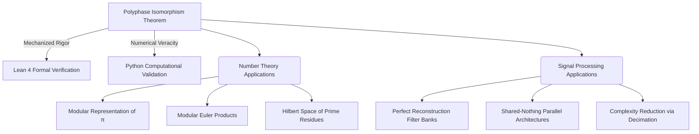
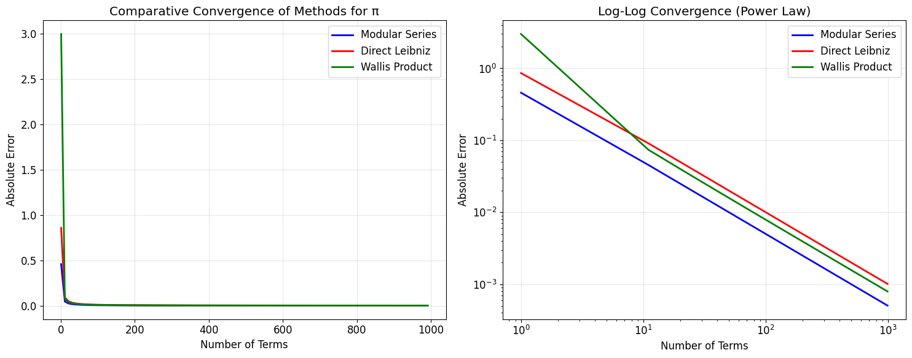

# Polyphase Isomorphism between Modular Arithmetic and Multirate Signal Processing

## *With Formal Verification in Lean 4 and Computational Validation*

[](https://creativecommons.org/licenses/by/4.0/)
[](https://www.python.org/)
[](https://colab.research.google.com/github/NachoPeinador/Espectro-Modular-Pi/blob/main/Notebooks/Formal_Verification_LEAN_4_Polyphase_Isomorphism.ipynb)
[](https://colab.research.google.com/github/NachoPeinador/Espectro-Modular-Pi/blob/main/Notebooks/Computational_Validation_Polyphase_Isomorphism.ipynb)
[](https://doi.org/10.5281/zenodo.17680023)
[](https://orcid.org/0009-0008-1822-3452)
[](https://github.com/NachoPeinador/Espectro-Modular-Pi/blob/main/Paper/Polyphase_Isomorphism_Modular_Arithmetic_MSP.pdf)

---

> **"An exact mathematical bridge between the arithmetic of integers and the filter banks of digital signal processing."**

---

## 🎯 TL;DR — The Essentials

> **What is this?** A formal mathematical proof and mechanized verification establishing that the modular decomposition of integer-indexed series in number theory is structurally isomorphic to polyphase decomposition (decimation and filter banks) in Digital Signal Processing (DSP).

* **The Theorem:** The projection of an infinite series $\sum a_n$ onto congruence classes modulo $m$ is mathematically identical to the multirate decimation of a discrete signal $x[n] = a_n$ by a factor $M = m$ evaluated at the Z-transform boundary ($z = 1$).
* **The Verification:** Certified axiomatically by the **Lean 4 kernel** (guaranteeing zero logical errors) and validated numerically via Python to machine precision ($10^{-14}$).
* **The Consequence:** Techniques from number theory (Euler products, modular representations of constants) transfer directly to optimal filter bank design, while engineering tools from DSP (perfect reconstruction, noble identities) apply directly to the accelerated evaluation of arithmetic series.
* **The Status:** An AMS-class research manuscript currently **Under Review** at *Mathematics of Computation*, backed by an open-access dual-validation pipeline.

---

## 🌌 Overview

This repository presents the theoretical framework, mechanized proofs, and computational validation of the article **"Polyphase Isomorphism between Modular Arithmetic and Multirate Signal Processing"**.

Two classical disciplines—number theory and digital signal processing—deal extensively with sequences indexed by integers. In number theory, infinite series $\sum a_n$ are studied by decomposing them into congruence classes modulo $m$. In DSP, discrete-time signals are swept into parallel channels known as *polyphase components* via decimation by a factor $M$. This work proves that these two core operations are **formally identical**.

### 🧩 The Thesis: One Isomorphism, Two Domains

We establish that the modular projection $S_r = \sum_k a_{mk+r}$ and the polyphase component $E_r(z) = \sum_k a_{mk+r} z^{-k}$ evaluated at $z=1$ are exact structural counterparts. This isomorphism guarantees **perfect reconstruction** (zero information loss) across both domains and provides a rigorous algebraic pipeline to transfer analytic tools between abstract mathematics and computational engineering.


```mermaid
graph TD
    A[Polyphase Isomorphism Theorem] -->|Mechanized Rigor| L[Lean 4 Formal Verification]
    A -->|Numerical Veracity| P[Python Computational Validation]
    
    A --> B(Number Theory Applications)
    A --> C(Signal Processing Applications)
    
    B --> B1[Modular Representation of π]
    B --> B2[Modular Euler Products]
    B --> B3[Hilbert Space of Prime Residues]
    
    C --> C1[Perfect Reconstruction Filter Banks]
    C --> C2[Shared-Nothing Parallel Architectures]
    C --> C3[Complexity Reduction via Decimation]
```

---

## 🚀 Key Scientific Contributions
 
### 1. The Polyphase Isomorphism Theorem
We formally prove that, for any absolutely convergent series $\{a_n\}$ and any modulus $m \ge 2$, the modular decomposition into residue classes and the polyphase decomposition with a decimation factor $M=m$ are isomorphic:

$$S_r = E_r(1), \qquad r = 0, \dots, m-1$$

The structural orthogonality of the channels in the index domain guarantees perfect reconstruction without aliasing, leakage, or numerical cross-talk.

### 2. Mechanized Formal Verification (Lean 4)
The mathematical foundations of the isomorphism are fully formalized and verified within the Lean 4 proof assistant using `Mathlib`. The kernel strictly certifies:
* **Modular Involution Duality:** Proof of the chiral symmetries in $\mathbb{Z}/6\mathbb{Z}$ (e.g., $5 \times 5 \equiv 1 \pmod 6$).
* **Unit Group Isomorphism:** Mechanical proof that $(\mathbb{Z}/6\mathbb{Z})^{\times} \cong \mathbb{Z}_2$, isolating the active prime channels.
* **Anti-Unitary Phase Symmetry:** Proof of the analytical phase offset $\Delta\phi = \pi$ between resonant branches.
* **Perfect Reconstruction:** Proof that parallel synthesis results in the exact destructive interference of sterile subbands.

### 3. The Hilbert Space of Prime Residues
For the special case of modulus $m=6$, we show that the resonant channels ($r=1,5$) form a closed Hilbert space $\mathcal{V}_6$ spanned by the orthonormal basis $\{\ket{1}, \ket{5}\}$. The classical Leibniz series for $\pi$ is reinterpreted as a geometric projection onto this space, exposing its internal arithmetic structure.
 
 ### 4. Cross-Disciplinary Applications

 #### 🔬 Number Theory
 * **Modular Leibniz series:**
  $$\pi = 3\sum_{k=0}^{\infty} (-1)^k \left(\frac{1}{6k+1} + \frac{1}{6k+5}\right)$$
 * **Modular Euler product:**
  $$\pi = \sqrt{9 \cdot \prod_{p>3, \ p \equiv \pm 1 \pmod{6}} \frac{p^2}{p^2-1}}$$
 
 #### ⚡ Signal Processing & Parallel Computing
 * **Perfect Reconstruction Filter Banks:** The disjointness of modular residues translates directly into alias-free, orthogonal subband filters.
 * **Shared-Nothing Architectures:** Bypasses the Memory Wall. Decomposing calculations into $m$ independent channels allows parallel execution with zero inter-thread data dependencies.
 * **Tree Compression:** Decimation by a factor of $m$ reduces the effective recursion depth of hypergeometric series evaluation by $\log_2 m$.
   
---

## 📊 Visual Validation: Perfect Reconstruction

The Colab notebook verifies the isomorphism numerically on the Leibniz series. The modular channels sum exactly to the original series value, confirming the perfect reconstruction property to machine precision.

<p align="center">


<em>Figure 1. Convergence comparison between the direct Leibniz series and its modular decomposition (m=6). Both converge to the same limit, but the modular version reveals the internal arithmetic structure.</em>
</p>

---

## 🧩 Structural Unification: Reformulating Classical Series

The modular paradigm operates as a universal structural framework. It applies not only to $\pi$ but to any mathematical constant defined by an integer-indexed series, revealing hidden symmetries and enabling new parallelization strategies through downsampled sequences.

| Mathematical Concept | Classical Formulation | Modular Polyphase Reformulation ($m=6$) |
| :--- | :--- | :--- |
| **Leibniz Constant ($\pi$)** | $$\frac{\pi}{4} = \sum_{k=0}^{\infty} \frac{(-1)^k}{2k+1}$$|$$\pi = 3 \sum_{k=0}^{\infty} (-1)^k \left( \frac{1}{6k+1} + \frac{1}{6k+5} \right)$$ |
| **Catalan Constant ($G$)** | $$G = \sum_{k=0}^{\infty} \frac{(-1)^k}{(2k+1)^2}$$|$$\sum_{r \in \{1,5\}} S_r - S_3 \quad \text{(Symmetric Prime Channels)}$$ |
| **Apéry Constant ($\zeta(3)$)** | $$\zeta(3) = \sum_{n=1}^{\infty} \frac{1}{n^3}$$|$$\sum_{r=1}^{6} \sum_{k=0}^{\infty} \frac{1}{(6k+r)^3} \quad \text{(Decimated Sub-series)}$$ |
| **Hypergeometric Functions** | $$\mathcal{F}(z) = \sum_{n=0}^{\infty} \frac{(a)_n (b)_n}{(c)_n n!} z^n$$|$$\mathcal{F}(z) = \sum_{r=0}^{m-1} z^r E_r(z^m) \quad \text{(Polyphase Reconstruction)}$$ |

> **💡 Computational Implication:** In the hypergeometric case, $E_r(z) = \sum_{k=0}^{\infty} a_{mk+r}z^k$ represents the exact downsampled polyphase filter component from DSP. This algebraic splitting allows decoupling a monolithic calculation into $m$ completely independent computing threads with zero data dependencies—rendering the framework ideal for massively parallel GPU, FPGA, or Shared-Nothing cluster implementations.
---

## 📂 Repository Structure

```text
Espectro-Modular-Pi/
├── 📄 Paper/                                           # Scientific manuscript (LaTeX/PDF)
│   └── Polyphase_Isomorphism_Modular_Arithmetic_MSP.pdf
├── 📓 Notebooks/                                       # Dual Validation Pipeline
│   ├── Formal_Verification_LEAN_4_Polyphase_Isomorphism.ipynb   <-- LEAN 4 VERIFICATION KERNEL
│   └── Computational_Validation_Polyphase_Isomorphism.ipynb    <-- PYTHON COMPUTATIONAL VALIDATION
├── 🖼️ Images/                                          # Generated figures & analytical plots
│   └── convergence_modular.png
└── 📜 README.md
```

---

## 💻 Reproducibility & Verification Pipeline

All code, algebraic proofs, and numerical experiments have been designed to be fully open, auditable, and reproducible. The verification pipeline is decoupled into two independent environments inside the `Notebooks/` directory.

### 1. Formal Verification Environment (Lean 4)
This environment executes the mechanized, interactive formal proofs of the isomorphism's algebraic foundations under the Lean 4 kernel, ensuring mathematical certainty and zero human error.

* **Notebook:** `Formal_Verification_LEAN_4_Polyphase_Isomorphism.ipynb`
* **Core Certifications:** Modular Involution, Unit Group Isomorphism $(\mathbb{Z}/6\mathbb{Z})^{\times} \cong \mathbb{Z}_2$, Anti-Unitary Phase Symmetry ($\Delta\phi = \pi$), and the Polyphase Perfect Reconstruction identity.
* **Requirements:** Lean 4 (`elan` version manager) and `Mathlib` (revision `fabf563`).

[](https://colab.research.google.com/github/NachoPeinador/Espectro-Modular-Pi/blob/main/Notebooks/Formal_Verification_LEAN_4_Polyphase_Isomorphism.ipynb)

---

### 2. Computational Validation Environment (Python)
This environment executes the empirical verification of the isomorphism, executing the modular channel splitting, evaluating convergence behaviors, and plotting the spectral properties of the sequences.

* **Notebook:** `Computational_Validation_Polyphase_Isomorphism.ipynb`
* **Core Experiments:** 1. **Perfect Reconstruction:** Verification of zero cross-channel energy leakage down to machine precision ($10^{-14}$).
  2. **Leibniz Representation:** Decimation and synthesis of the alternating Leibniz series over active resonant channels ($\mathcal{C}_1 \oplus \mathcal{C}_5$).
  3. **Euler Product Expansion:** Convergence verification of the modular prime-bound Euler product.
* **Requirements:** Python 3.10+, `numpy`, `matplotlib`, `sympy`.

[](https://colab.research.google.com/github/NachoPeinador/Espectro-Modular-Pi/blob/main/Notebooks/Computational_Validation_Polyphase_Isomorphism.ipynb)

---

### 🛠️ Local Execution Setup

If you prefer to clone the repository and run the pipeline locally instead of using the cloud interactive instances, execute the following commands:

```bash
# Clone the repository
git clone [https://github.com/NachoPeinador/Espectro-Modular-Pi.git](https://github.com/NachoPeinador/Espectro-Modular-Pi.git)
cd Espectro-Modular-Pi

# Install Python dependencies for the computational validation
pip install numpy matplotlib sympy jupyter
```

---

## 🌐 The Broader Research Programme

This work is part of a larger investigation into the physical and computational consequences of the $\mathbb{Z}/6\mathbb{Z}$ modular symmetry of the Standard Model vacuum. Related projects include:

* **[Modular-Substrate-Theory](https://github.com/NachoPeinador/Modular-Substrate-Theory):** Unified framework for cosmology and hadronic physics.
* **[Arquitectura-de-Hibridacion-Algoritmica-en-Z-6Z](https://github.com/NachoPeinador/Arquitectura-de-Hibridacion-Algoritmica-en-Z-6Z):** DSP architecture for extreme-precision $\pi$ computation.
* **[Phase-Pi-Quantum-Prior](https://github.com/NachoPeinador/Phase-Pi-Quantum-Prior):** Topological state preparation and dissipative protection for quantum registers.

**Common Thread:** All projects leverage modular arithmetic ($\mathbb{Z}/6\mathbb{Z}$) as a fundamental organising principle across mathematics, physics, and computation.

---

## ✍️ Citation

If you use this work, code, or methodology in your research, please cite:

```bibtex
@misc{peinador2026polyphase,
  author = {Peinador Sala, José Ignacio},
  title = {Polyphase isomorphism between modular arithmetic and multirate digital signal processing: With formal verification in Lean 4 and computational validation},
  year = {2026},
  publisher = {Zenodo},
  doi = {10.5281/zenodo.17680023},
  url = {https://doi.org/10.5281/zenodo.17680023}
}
```

---

## ❤️ Support Independent Science

This work is the result of independent research, without institutional funding. The authority of science lies in evidence, not affiliation.

If you value this effort:

1. ⭐ **Star** this repository.
2. 📢 **Share** the findings on Twitter/LinkedIn.
3. 💬 **Open an Issue** if you have ideas to extend the theory.

**Author:** José Ignacio Peinador Sala

**Contact:** [joseignacio.peinador@gmail.com](mailto:joseignacio.peinador@gmail.com)

---

📝 Manuscript Status: This work has been submitted to SeMA Journal (Springer) for publication consideration.
* Theoretical Foundation Paper ID: SEMJ-S-26-00195
* Parallel Architecture Companion Paper ID: SEMJ-S-26-00196

---

> 🌌 **El Universo Aritmético / The Arithmetic Universe** >

> 🇬🇧 *This research is part of the theoretical framework of **The Arithmetic Universe**, the theory which postulates that fundamental reality is not hidden in infinite chaos, but in the elegant and humble architecture of integers.* > 🔗 **[Discover the central repository, the interactive notebooks, and the Lean 4 validation here](https://github.com/NachoPeinador/EL_UNIVERSO_ARITMETICO)**.
>
> 🇪🇸 *Esta investigación forma parte del marco teórico de **El Universo Aritmético**, la teoría que postula que la realidad fundamental no se esconde en el caos infinito, sino en la elegante y humilde arquitectura de los números enteros.* > 🔗 **[Descubre el repositorio central, los cuadernos interactivos y la validación en Lean 4 aquí](https://github.com/NachoPeinador/EL_UNIVERSO_ARITMETICO)**.
