# The Modular Spectrum of $\pi$
### From Prime Channel Structure to Elliptic Supercongruences

[](https://github.com/NachoPeinador/Espectro-Modular-Pi/blob/main/README_ES.md)
[](LICENSE-AGPL.md)
[](https://www.python.org/)
[](https://colab.research.google.com/github/NachoPeinador/Espectro-Modular-Pi/blob/main/Notebooks/Modular_π_Spectrum.ipynb)
[](https://doi.org/10.5281/zenodo.18417862)
[](https://orcid.org/0009-0008-1822-3452)
[](https://github.com/NachoPeinador/Espectro-Modular-Pi/blob/main/Paper/Modular_Spectrum_of_π.pdf)

> **"An unprecedented unification between classical linear analysis and high-energy modular form theory."**

---

## 🎯 TL;DR - The Essentials

> **What is this?** A new theory connecting the constant $\pi$ with the distribution of prime numbers.

* **The Discovery:** We demonstrate that $\pi$ is not a monolithic structure, but is built upon prime modular channels ($6k \pm 1$).
* **The Unification:** This approach bridges simple formulas (Leibniz-type) with ultra-fast formulas (Ramanujan-type).
* **The Experiment:** We use integer relation detection algorithms (PSLQ) with 200-digit precision to "rediscover" $\pi$ formulas converging at 8 digits per step.
* **The Result:** A full *paper* and an executable *notebook* validating frontier mathematics using accessible Python code.

---

## 🌌 Overview

This project presents the theoretical framework and experimental validation of the article **"The Modular Spectrum of $\pi$"**.

Historically, $\pi$ has been studied from two disconnected fronts: slow series (Leibniz) and fast series (Ramanujan). This work demonstrates that both are extremes of the same **continuous spectrum**, governed by the arithmetic structure of prime numbers in $\mathbb{Z}/6\mathbb{Z}$.

### 🧩 The Thesis: Modular Uniformity
We postulate that the arithmetic information of $\pi$ flows through two "prime channels" ($6k+1$ and $6k+5$), creating a structure that scales from basic arithmetic to the geometry of elliptic curves.

```mermaid
graph TD
    A[The Modular Spectrum of π] --> B(Low Energy: Level 6)
    A --> C(High Energy: Level 58)
    A --> D(Local Arithmetic)
    
    B --> B1[Prime Filter 6k ± 1]
    B --> B2[Linear Convergence]
    
    C --> C1[Modular Invariants j-function]
    C --> C2[PSLQ Algorithm]
    C --> C3[Exponential Convergence]
    
    D --> D1[Supercongruences p=17]
    D --> D2[Spigot Algorithms / Holography]

```



---

## 🚀 Key Scientific Findings

### 1. The Arithmetic Substrate (Low Energy)

We demonstrate that  emerges naturally by filtering the "noise" of composite numbers (multiples of 2 and 3), revealing its structure in the prime channels:

$$ \pi = 3 \sum_{k=0}^{\infty} (-1)^k \left( \frac{1}{6k+1} + \frac{1}{6k+5} \right) $$

### 2. Elliptic Acceleration (Level 58)

Using experimental mathematics and the **PSLQ** algorithm with 200-digit precision, we reconstructed the Ramanujan-Sato series associated with the discriminant .

| Parameter | Discovered Value | Meaning |
| --- | --- | --- |
| **Coef. A** | `1103` | Base linear term |
| **Coef. B** | `26390` | Acceleration per iteration |
| **Base** | `396^4` | Modular Invariant  |
| **Convergencia** | **~8 digits/term** | Successful validation |


### 3. The Inert Prime Anomaly ($p=17$)

We numerically detected that the Level 58 series "knows" the arithmetic of finite fields. For $p=17$ an inert prime in $\mathbb{Q}(\sqrt{-58})$ , the truncated sum satisfies a strict supercongruence:

$$ S_{58}(17) \equiv 246 \pmod{289} $$

---

### 📊 Visual Validation: Convergence Analysis

Experiments confirm that, although the **Modular Series** (blue) shares the linear convergence rate  with the classical Leibniz series (red), its algebraic structure is distinct. The Log-Log plot (right) validates the power law of the error.

<p align="center">


<em>Figure 1. Absolute error comparison at . Generated from the experimental Notebook.</em>
</p>

---

## 🧩 Structural Unification: Reformulating the Classics

The modular paradigm  applies not only to  but allows rewriting fundamental formulas of mathematical analysis, revealing hidden symmetries and enabling new parallelization strategies.

| Concept | Classical Formula | Modular Reformulation (Our Proposal) |
| :--- | :--- | :--- |
| **Leibniz** | $\displaystyle \frac{\pi}{4} = \sum_{k=0}^{\infty} \frac{(-1)^k}{2k+1}$ | $\displaystyle \pi = 3 \sum_{k=0}^{\infty} (-1)^k \left( \frac{1}{6k+1} + \frac{1}{6k+5} \right)$ |
| **Euler** | $\displaystyle e^{i\pi} + 1 = 0$ | $\displaystyle e^{i\left[3 \sum (-1)^k \left( \frac{1}{6k+1} + \frac{1}{6k+5} \right)\right]} + 1 = 0$ |
| **Wallis** | $\displaystyle \frac{\pi}{2} = \prod_{k=1}^{\infty} \frac{4k^2}{4k^2-1}$ | Separate product over prime channels $\mathcal{C}_1$ y $\mathcal{C}_5$ |
| **Normal** | $\displaystyle \int_{-\infty}^{\infty} e^{-x^2/2} dx = \sqrt{2\pi}$ | $\displaystyle \sqrt{6 \sum_{k=0}^{\infty} (-1)^k \left( \frac{1}{6k+1} + \frac{1}{6k+5} \right)}$ |

> **💡 Computational Implication:** The reformulation of the Leibniz series allows decoupling the calculation into two independent threads (memory streams for $6k+1$ and $6k+5$ ) without data dependencies, ideal for GPU/FPGA implementations.

---

## 📂 Repository Structure

```text
Espectro-Modular-Pi/
├── 📄 Paper/                  # Scientific manuscript (LaTeX/PDF)
│   └── ESPECTRO_MODULAR_π.pdf
├── 📓 Notebooks/              # Experimental Validation
│   └── ESPECTRO_MODULAR_π.ipynb  <-- EXPERIMENTAL CORE
├── 🎓 Educacion/              # Educational Suite (High School/University)
│   ├── Modulo_1_Aritmetica.ipynb
│   └── ...
└── 📜 README.md

```

---

## 💻 Reproducibility

All code has been designed to be auditable and reproducible.

**Requirements:**

* Python 3.10+
* `mpmath` (for arbitrary precision arithmetic >200 digits)
* `sympy`, `numpy`, `scipy`

**Cloud Execution:**
You can replicate the convergence experiments, the Spigot algorithm, and PSLQ detection directly in Google Colab:

[](https://colab.research.google.com/github/NachoPeinador/Espectro-Modular-Pi/blob/main/Notebooks/Modular_π_Spectrum.ipynb)

---

## 🎓 Educational Suite

This project transcends pure research; it seeks to democratize advanced mathematics. We have created 5 interactive modules for students:

1. **Modular Arithmetic:** Understanding the mathematical clock.
2. **Connections:** Statistics and Algebra.
3. **Simulation:** Geometry and Chaos.
4. **Engineering:** Computational Algorithms.
5. **Deep Theory:** Sequences and Matrices.

## [👉 Access the Educational Space and Teacher's Guide](Teachers_Guide.md)

---

## 🛰️ Next Step: From Theory to Exascale

If the **Modular Spectrum** defines the mathematical anatomy of , the **Algorithmic Hybridization Architecture** is its engineering engine.

I have developed an advanced implementation that pushes these concepts to the computational limit, achieving **100 million digits** with 95% parallel efficiency through a formal isomorphism with Digital Signal Processing (DSP).

### [👉 Explore the Hybridization Architecture in Z/6Z ](https://github.com/NachoPeinador/Arquitectura-de-Hibridacion-Algoritmica-en-Z-6Z/blob/main/README.md)

**What you will find there:**

* **DSP Isomorphism:** Formal proofs of how  modulation is mathematically equivalent to polyphase filter banks.
* **Stride-6 Engine:** A *Shared-Nothing* algorithm that breaks the "memory wall" in high-precision computation.
* **Spectral Rigidity Validation:** Statistical analysis of Riemann zeros under the modular filter ($p \approx 0.98$).

---

## ✍️ Citation

If you use this work, code, or methodology in your research, please cite:

```bibtex
@misc{peinador2025modular,
  author = {Peinador Sala, José Ignacio},
  title = {The Modular Spectrum of \pi: From Prime Channel Structure to Elliptic Supercongruences},
  year = {2025},
  publisher = {Zenodo},
  doi = {10.5281/zenodo.17680024},
  url = {[https://doi.org/10.5281/zenodo.18417862](https://doi.org/10.5281/zenodo.18417862)}
}

```

---

## ❤️ Support Independent Science

This work is the result of independent research, without institutional funding. The authority of science lies in evidence, not affiliation.

If you value this effort:

1. ⭐️ **Star** this repository (top right).
2. 📢 **Share** the findings on Twitter/LinkedIn.
3. 💬 **Open an Issue** if you have ideas to extend the theory.

**Author:** José Ignacio Peinador Sala

**Contact:** [joseignacio.peinador@gmail.com](mailto:joseignacio.peinador@gmail.com)

