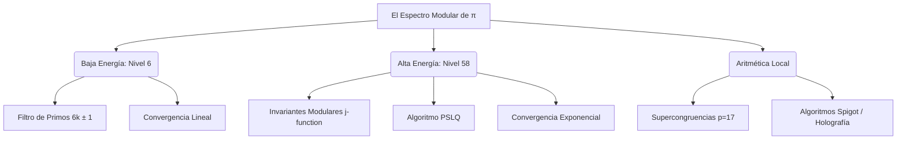

# 𝜋 The Modular Spectrum of Pi
### From Prime Channel Structure to Elliptic Supercongruences

[](LICENSE-AGPL.md)
[](https://www.python.org/)
[](https://colab.research.google.com/github/NachoPeinador/Espectro-Modular-Pi/blob/main/Notebooks/ESPECTRO_MODULAR_π.ipynb)
[](https://doi.org/10.5281/zenodo.17680024)
[](https://orcid.org/0009-0008-1822-3452)

> **"Una unificación inédita entre el análisis lineal clásico y la teoría de formas modulares de alta energía."**

---

## 🎯 TL;DR - Lo Esencial

> **¿Qué es esto?** Una nueva teoría que conecta la constante $\pi$ con la distribución de los números primos.

* **El Descubrimiento:** Demostramos que $\pi$ no es una estructura monolítica, sino que se construye sobre canales modulares primos ($6k \pm 1$).
* **La Unificación:** Este enfoque une las fórmulas simples (tipo Leibniz) con las fórmulas ultra-rápidas (tipo Ramanujan).
* **El Experimento:** Usamos algoritmos de búsqueda de relaciones enteras (PSLQ) con 200 dígitos de precisión para "redescubrir" fórmulas de $\pi$ que convergen a 8 dígitos por paso.
* **El Resultado:** Un *paper* completo y un *notebook* ejecutable que validan matemáticas de frontera usando código Python accesible.

---

## 🌌 Visión General

Este proyecto presenta el marco teórico y la validación experimental del artículo **"El Espectro Modular de $\pi$"**. 

Históricamente, $\pi$ se ha estudiado desde dos frentes desconectados: las series lentas (Leibniz) y las rápidas (Ramanujan). Este trabajo demuestra que ambas son extremos de un mismo **espectro continuo**, gobernado por la estructura aritmética de los números primos en $\mathbb{Z}/6\mathbb{Z}$.

### 🧩 La Tesis: Uniformidad Modular
Postulamos que la información aritmética de $\pi$ fluye a través de dos "canales primos" ($6k+1$ y $6k+5$), creando una estructura que escala desde la aritmética básica hasta la geometría de curvas elípticas.



---

## 🚀 Principales Hallazgos Científicos

### 1. El Sustrato Aritmético (Baja Energía)

Demostramos que  emerge naturalmente al filtrar el "ruido" de los números compuestos (múltiplos de 2 y 3), revelando su estructura en los canales primos:

$$ \pi = 3 \sum_{k=0}^{\infty} (-1)^k \left( \frac{1}{6k+1} + \frac{1}{6k+5} \right) $$

### 2. Aceleración Elíptica (Nivel 58)

Utilizando matemáticas experimentales y el algoritmo **PSLQ** con 200 dígitos de precisión, reconstruimos la serie de Ramanujan-Sato asociada al discriminante .

| Parámetro | Valor Descubierto | Significado |
| --- | --- | --- |
| **Coef. A** | `1103` | Término lineal base |
| **Coef. B** | `26390` | Aceleración por iteración |
| **Base** | `396^4` | Invariante Modular  |
| **Convergencia** | **~8 dígitos/término** | Validación exitosa |

### 3. La Anomalía del Primo Inerte ($p=17$)

Detectamos numéricamente que la serie de Nivel 58 "conoce" la aritmética de cuerpos finitos. Para $p=17$ un primo inerte en $\mathbb{Q}(\sqrt{-58})$ , la suma truncada satisface una supercongruencia estricta:

$$ S_{58}(17) \equiv 246 \pmod{289} $$

---

## 📂 Estructura del Repositorio

```text
Espectro-Modular-Pi/
├── 📄 Paper/                  # Manuscrito científico (LaTeX/PDF)
│   └── ESPECTRO_MODULAR_π.pdf
├── 📓 Notebooks/              # Validación Experimental
│   └── ESPECTRO_MODULAR_π.ipynb  <-- NÚCLEO EXPERIMENTAL
├── 🎓 Educacion/              # Suite Educativa (Bachillerato/Universidad)
│   ├── Modulo_1_Aritmetica.ipynb
│   └── ...
└── 📜 README.md

```

---

## 💻 Reproducibilidad

Todo el código ha sido diseñado para ser auditable y reproducible.

**Requisitos:**

* Python 3.10+
* `mpmath` (para aritmética de precisión arbitraria >200 dígitos)
* `sympy`, `numpy`, `scipy`

**Ejecución en la Nube:**
Puedes replicar los experimentos de convergencia, el algoritmo Spigot y la detección PSLQ directamente en Google Colab:

[](https://colab.research.google.com/github/NachoPeinador/Espectro-Modular-Pi/blob/main/Notebooks/ESPECTRO_MODULAR_π.ipynb)

---

## 🎓 Suite Educativa

Este proyecto trasciende la investigación pura; busca democratizar las matemáticas avanzadas. Hemos creado 5 módulos interactivos para estudiantes:

1. **Aritmética Modular:** Entendiendo el reloj matemático.
2. **Conexiones:** Estadística y Álgebra.
3. **Simulación:** Geometría y Caos.
4. **Ingeniería:** Algoritmos Computacionales.
5. **Teoría Profunda:** Sucesiones y Matrices.

## [👉 Acceder al Espacio Educativo y Guía Docente](GUIA_DOCENTE.md)

---

## ✍️ Citación

Si utilizas este trabajo, código o metodología en tu investigación, por favor cita:

```bibtex
@misc{peinador2025modular,
  author = {Peinador Sala, José Ignacio},
  title = {The Modular Spectrum of \pi: From Prime Channel Structure to Elliptic Supercongruences},
  year = {2025},
  publisher = {Zenodo},
  doi = {10.5281/zenodo.17680024},
  url = {[https://doi.org/10.5281/zenodo.17680024](https://doi.org/10.5281/zenodo.17680024)}
}

```

---

## ❤️ Apoyo a la Ciencia Independiente

Este trabajo es fruto de la investigación independiente, sin financiación institucional. La autoridad de la ciencia reside en la evidencia, no en la filiación.

Si valoras este esfuerzo:

1. ⭐️ **Dale una estrella** a este repositorio (arriba a la derecha).
2. 📢 **Comparte** los hallazgos en Twitter/LinkedIn.
3. 💬 **Abre un Issue** si tienes ideas para extender la teoría.

**Autor:** José Ignacio Peinador Sala

**Contacto:** [joseignacio.peinador@gmail.com](mailto:joseignacio.peinador@gmail.com)

```
